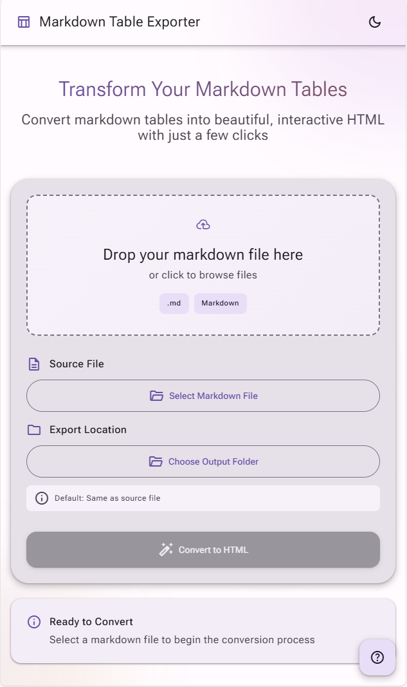
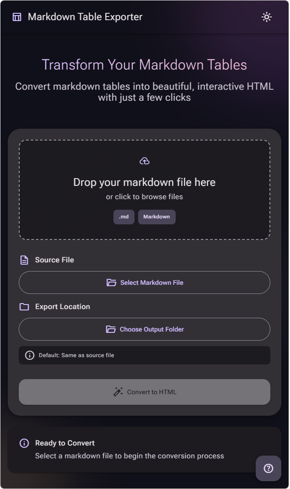
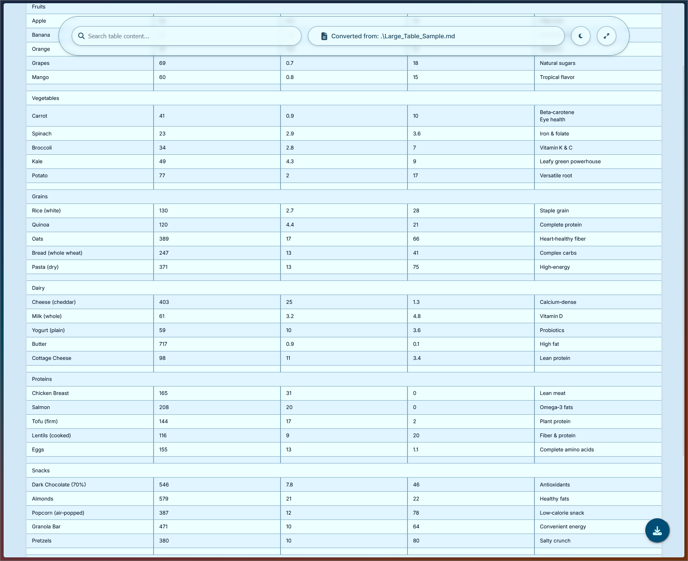
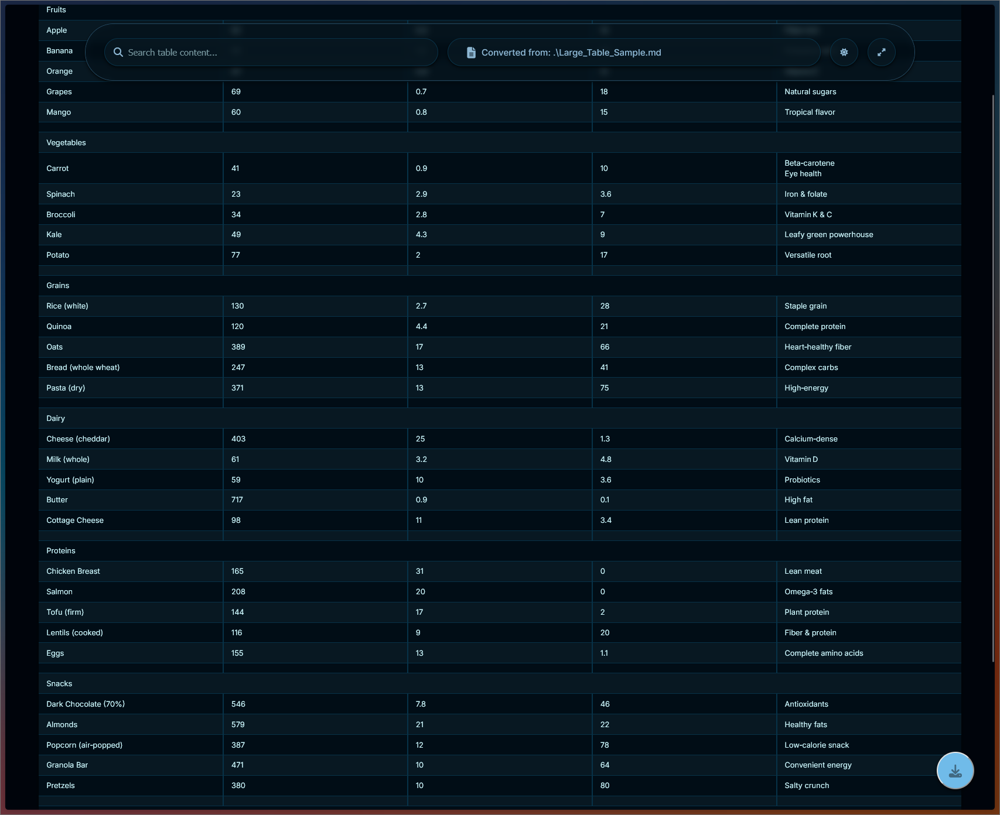
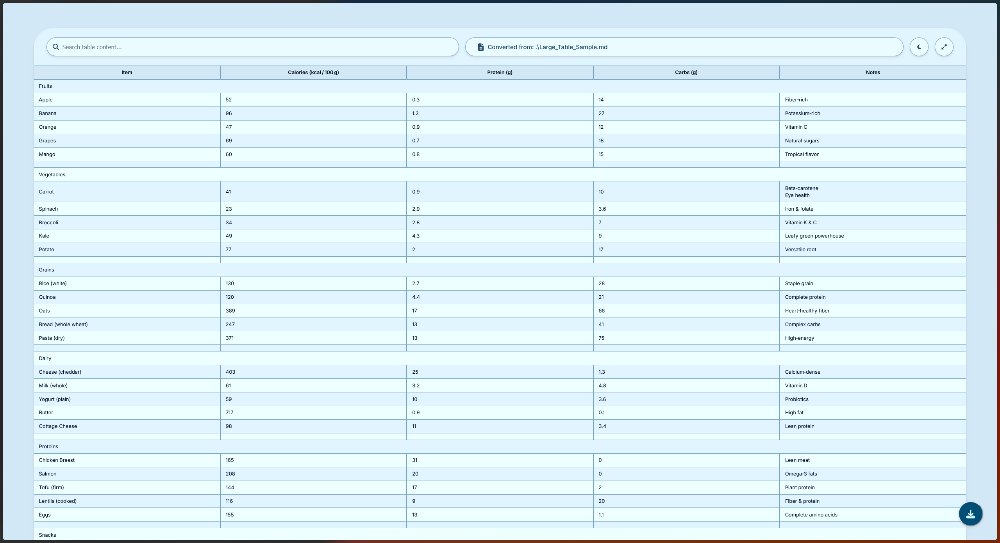

# Markdown Table Exporter v1.0.0

**Transform Markdown tables into beautiful, interactive HTML documents with professional styling and advanced animations.**

A desktop application and command-line tool that converts `.md` files containing Markdown tables into modern, responsive, self-contained `.html` files featuring dynamic themes, spring-based animations, and comprehensive export capabilities.

---

## ✨ Key Features

### 🎨 **Modern Material 3 Design**
- **Expressive UI** with fluid spring-based animations
- **Dynamic theming** with light/dark mode support
- **Responsive layout** optimized for desktop usage
- **Accessibility-first** design with reduced motion support

### 🚀 **Advanced Animation System**
- **Apple-style spring physics** for natural, organic motion
- **Contextual reactions** where elements respond to each other
- **Performance optimized** with intelligent animation limiting
- **Smooth state transitions** throughout the application

### 📊 **Comprehensive Table Processing**
- **GitHub-style Markdown** table parsing
- **Category row detection** (first cell with text, rest empty)
- **Rich content support** including `<br>` tags and inline formatting
- **Metadata extraction** (file size, line count, table dimensions)

### 💾 **Multiple Export Options**
- **Styled HTML** with embedded CSS and JavaScript
- **CSV export** for data analysis
- **PDF generation** with professional formatting
- **HTML snippet** copying for web integration

### 🎛️ **Professional User Experience**
- **Drag & drop** file loading with visual feedback
- **Command palette** (Ctrl+K) for power users
- **Keyboard shortcuts** for efficient workflow
- **Real-time file validation** and error handling
- **Progress tracking** with animated indicators

---

## 📸 Screenshots

### Desktop Application Interface

<table align="center">
  <tr>
    <td align="center">
      
      <br>
      <em>Light Mode Interface</em>
    </td>
    <td align="center">
      
      <br>
      <em>Dark Mode Interface</em>
    </td>
  </tr>
</table>

### Generated HTML Output

<table align="center">
  <tr>
    <td align="center">
      
      <br>
      <em>Generated HTML - Light Theme</em>
    </td>
    <td align="center">
      
      <br>
      <em>Generated HTML - Dark Theme</em>
    </td>
  </tr>
</table>

<p align="center">
  
  <br>
  <em>Interactive features: search, export options, responsive design</em>
</p>

---

## 🚀 Installation & Usage

### **Option 1: Pre-built Executable (Recommended for End Users)**

> **Note**: Pre-built executables are not currently available. Please follow Option 2 or 3 below, or check the [Releases](https://github.com/Econ01/markdown-table-exporter/releases) section for future builds.

1. Download the latest `.exe` file from the [Releases](https://github.com/Econ01/markdown-table-exporter/releases) page
2. Run the executable directly - no Python installation required
3. The application will open with the graphical interface

### **Option 2: Command Line Usage (Direct Script)**

For quick conversions without the GUI:

**Prerequisites:**
- Python 3.7+
- Required packages (see requirements section)

**Usage:**
```bash
# Clone the repository
git clone https://github.com/Econ01/markdown-table-exporter.git
cd markdown-table-exporter

# Install dependencies
pip install pywebview

# Convert directly via command line
python md_table_to_html.py input.md output.html
```

**Example:**
```bash
python md_table_to_html.py my_table.md my_table.html
```

### **Option 3: Desktop GUI Application**

**Prerequisites:**
- Python 3.7+
- PyWebView

**Setup:**
```bash
# Clone the repository
git clone https://github.com/Econ01/markdown-table-exporter.git
cd markdown-table-exporter

# Install dependencies
pip install pywebview

# Run the GUI application
python gui_app.py
```

**Usage:**
1. **Launch** the application
2. **Select** a `.md` file containing a Markdown table:
   - Click "Select Markdown File" or
   - Drag & drop file onto the upload zone
3. **Choose** output location (optional - defaults to source file directory)
4. **Click** "Convert to HTML" to generate your styled table
5. **Export** in additional formats as needed (CSV, PDF)

### **Option 4: Build Your Own Executable**

For developers who want to create their own executable:

**Prerequisites:**
- Python 3.7+
- PyInstaller
- PyWebView

**Build Process:**
```bash
# Clone and navigate to project
git clone https://github.com/Econ01/markdown-table-exporter.git
cd markdown-table-exporter

# Install build dependencies
pip install pyinstaller pywebview

# Run the build script (Windows)
build_exe.bat

# Or manually with PyInstaller
pyinstaller --noconfirm --onefile --windowed --add-data "templates;templates" --add-data "static;static" gui_app.py
```

The executable will be created in the `dist/` folder.

---

## 📋 Requirements

### **System Requirements**
- **Operating System**: Windows 10+, macOS 10.14+, Linux (Ubuntu 18.04+)
- **Python**: 3.7+ (for source usage)
- **Memory**: 256MB RAM minimum
- **Storage**: 100MB available space

### **Python Dependencies**
Create a `requirements.txt` file with:
```
pywebview>=4.0
pathlib2>=2.3.5
```

**For building executables:**
```
pyinstaller>=5.0
```

**Installation:**
```bash
pip install -r requirements.txt
```

---

## 🎛️ Application Features

### **Desktop GUI Features**
- **Modern Interface**: Material 3 design with spring animations
- **File Management**: Drag & drop, file browser integration
- **Real-time Preview**: File information and validation
- **Theme Support**: Light/dark mode with smooth transitions
- **Export Options**: Multiple format support built-in

### **Command Line Features**
- **Direct Conversion**: `python md_table_to_html.py input.md output.html`
- **Batch Processing**: Scriptable for multiple files
- **Integration Ready**: Use in build pipelines or automation

### **Generated HTML Features**
- **Self-contained**: No external dependencies
- **Interactive**: Search, sort, and export functionality
- **Responsive**: Works on all screen sizes
- **Themeable**: Built-in light/dark mode toggle
- **Printable**: Optimized for physical documents

### **Keyboard Shortcuts (GUI)**
- `Ctrl+K` - Open command palette
- `Ctrl+O` - Open file dialog
- `Ctrl+T` - Toggle theme
- `Ctrl+Enter` - Start conversion
- `F1` - Show help dialog
- `Esc` - Close dialogs/palette

---

## 📝 Supported Markdown Features

### **Table Syntax**
```markdown
| Feature | Status | Notes |
|---------|--------|-------|
| Basic tables | ✅ | Full support |
| **Bold text** | ✅ | Inline formatting |
| *Italic text* | ✅ | Emphasis support |
| `Code snippets` | ✅ | Monospace formatting |
| [Links](url) | ✅ | Clickable links |
| Line<br>breaks | ✅ | Multi-line cells |
| ~~Strikethrough~~ | ✅ | Text decoration |
|               |    |         |
| Category Section |    |         |
| Item 1 | Data | More info |
| Item 2 | Data | More info |
```

### **Special Features**
- **Category Row Detection**: Automatic styling when first cell has content and others are empty
- **Rich Formatting**: Full Markdown inline syntax support
- **Multi-line Content**: `<br>` tag support for cell line breaks
- **Flexible Structure**: Variable column counts handled gracefully

---

## 🏗️ Technical Architecture

### **Hybrid Desktop Application**
- **Frontend**: HTML5, CSS3, JavaScript (ES6+) with Material 3 design
- **Backend**: Python with PyWebView for desktop integration
- **Animation Engine**: Custom spring physics system
- **Packaging**: PyInstaller for standalone executables

### **Project Structure**
```
markdown-table-exporter/
├── gui_app.py                 # Main GUI application
├── md_table_to_html.py        # Core conversion engine + CLI
├── build_exe.bat              # Windows build script
├── templates/
│   └── index.html             # GUI interface template
├── static/
│   ├── main.css               # Main stylesheet
│   ├── main.js                # Application logic
│   └── js/
│       ├── core/              # Core systems (spring physics, state)
│       └── features/          # Feature modules (file ops, themes)
└── assets/                    # Screenshots and documentation
```

### **Key Technologies**
- **PyWebView**: Desktop application framework
- **Spring Physics**: Custom animation system
- **Material 3**: Design system implementation
- **Modular CSS**: Component-based styling
- **Vanilla JavaScript**: No external dependencies

---

## 🔧 Development

### **Development Setup**
```bash
# Clone repository
git clone https://github.com/Econ01/markdown-table-exporter.git
cd markdown-table-exporter

# Install development dependencies
pip install pywebview

# Run in development mode
python gui_app.py
```

### **Browser Development**
For frontend development, you can open `templates/index.html` directly in a browser, but note:
- **Limited functionality**: File operations require the Python backend
- **Development only**: Not intended for production browser use
- **GUI features**: Will not work without PyWebView integration

### **Code Structure**
- **Modular Design**: Clean separation between frontend and backend
- **Reusable Components**: Animation system can be used in other projects
- **Type-safe Ready**: Architecture supports easy TypeScript migration
- **Performance Focused**: Efficient rendering and animation systems

---

## ⚠️ Limitations

### **Known Limitations**
- **Desktop Only**: Full functionality requires PyWebView (desktop environment)
- **Browser Compatibility**: Limited functionality when opened in web browsers
- **File System**: Requires local file system access for full feature set
- **Single File**: Processes one Markdown file at a time via GUI

### **Technical Constraints**
- **Python Dependency**: Source version requires Python 3.7+
- **Modern Browser**: Generated HTML requires ES6+ support
- **File Size**: Large tables may impact performance
- **Markdown Parsing**: Follows standard GitHub-style table syntax

---

## 📄 License

This project is licensed under the **MIT License** - see the [LICENSE](LICENSE) file for details.

---

## 🔗 Links

- **Repository**: [https://github.com/Econ01/markdown-table-exporter](https://github.com/Econ01/markdown-table-exporter)
- **Issues**: [https://github.com/Econ01/markdown-table-exporter/issues](https://github.com/Econ01/markdown-table-exporter/issues)
- **Releases**: [https://github.com/Econ01/markdown-table-exporter/releases](https://github.com/Econ01/markdown-table-exporter/releases)

---

## 📞 Support

This project is provided as-is without ongoing support guarantees. For issues or questions:

1. **Check existing issues** in the GitHub repository
2. **Create a new issue** with detailed information
3. **Include system information** and steps to reproduce any problems

---

## 🙏 Acknowledgments

- **Material Design 3** for design system guidelines
- **PyWebView** for desktop application framework
- **Spring Physics** inspiration from natural motion systems
- **Open Source Community** for tools and inspiration

---

<p align="center">
  
  
  
  
</p>